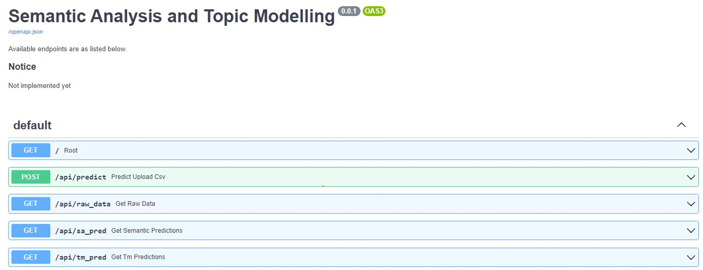

# DSA4263: Voice of the Customer (VoC) Analysis

## Introduction

The Voice of the Customer (VoC) is a methodology used to capture customers’ needs, requirements, and perceptions about products or services. In this project, we seek to develop and end-end solution for Voice of Customer analysis to provide insights to end business users using a public customer feedback dataset.

## Installation

1. **Docker**

Run  

```
docker build -t api .
```  

```
docker run -d -p 5000:5000 api
```

2. **Virtual Environment**

- Create a virtual environment of your choice; eg:

```
virtualenv venv
```

- Activate virtual environment & Install dependencies

```
source venv/Scripts/activate
```

```
pip install -r requirements.txt
```

- Run the API with

```
uvicorn --app-dir=./root/src main:app --port 5000
```

The app is hosted on -
```localhost (127.0.0.1)``` at port ```5000```. API documentation is available at ```127.0.0.1:5000/docs```



Some usage examples can be found in the [api_demo notebook](https://https://github.com/nivii26/DSA4263-Voice-of-Customer-VOC-analysis/tree/main/root/ipynb/api_demo.ipynb)

## Task Breakdown

### TASK 1 : Sentiment Analysis
**Preprocessing**: Our preprocessing methodology for Sentiment Classification is to generate word embeddings for the 'Text' column in reviews.csv by concatinating the embeddings generated from Word2vec and TF-IDF (Term Frequency - Inverse Document Frequency). We then apply PCA (Principal Component Analysis) to reduce the dimensionality of the embedding space. This step can help to speed up the subsequent analysis while still retaining the important features of the text.

To run the preprocessing step please view the python notebook.

**Training**: We experiment with several classification models such as the Naive Baye's Classifier, Logistic Regression, SVM (Support Vector Machine), XGBoost and pretrained models like Vader and Falir. View the table below for relative perfromace of these models on the test data (from train-test split) and our inference - 
Performance Comparision Table

|    Model             |    Weighted F1 (train)    |       Weighted F1 (Test)| PR_AUC (TRAIN) | PR_AUC (TEST) |  Evaluation|
| -----------          | -----------               | -----------             |-----------     |-----------    |   -----| 
|  Naive Baye's        |    0.72   |     0.54 |      0.81      | 0.72  | Overfit train data (Baseline performance) |
|  Logistic Regression |    0.88                   |    0.86                     |      0.96      | 0.96    | Good but SVM performs better |
|   Non - Linear SVM   |    0.9                    |     0.87                    |      0.97      | 0.97    | Best Performance (with our own pre-processing)|
|   XGBoost            |    0.9                    |     0.79                    |      0.96      | 0.94   | Overfit train data|
|   Vader              |    0.80                   |     0.87                    |      0.93      | 0.94   | Rule-based, not the best approach|
|   Flair              |    0.94                   |      0.93                   |      0.99      | 0.99   | Best perfromance (pretrained)|

The two best perfroming models were Non-Linear SVM and Flair based on the above metrics of 'weighted F1 score' and 'PR-AUC'. Hence our, final model is an ensemble of these two models based on aggregration (average).

**Predict**: The prediction method takes a preprocessed DataFrame (fot SVM) and original cleaned up text (for the model 'Flair') as input. The output is a DataFrame with the the sentiment_labels and probabilities from the two individual models and the final_sentiment and final_probability from the ensembling process, which are our final sentiment predictions.

### TASK 2 : Topic Modeling

To train the topic model from outside of the root directory, run: ```python -m root.src.model.tm.tm_train```. This will train and deposit a topic model into root/models/tm/. Configuration of the training hyperparameters is specified in [config.yml file](https://https://github.com/nivii26/DSA4263-Voice-of-Customer-VOC-analysis/tree/main/root/src/model/tm/config.yml).

### TASK 3 : Visualization

To load the visualisation locally, ensure that the packages streamlit and Circlify (in the requirements.txt) are already installed.

Run the following command in the terminal to access the dashboard through a local host.

```
streamlit run root/src/visualization/visualize.py path_to_file_to_visualize
```

Alternatively, view ['this repository'](https://github.com/nivii26/VoC-streamlit-app) for a demo of our streamlit app!

Click ['here'](https://share.streamlit.io/app/nivii26-voc-streamlit-app-visualize-9xla2m/) to access a demo_dashboard
